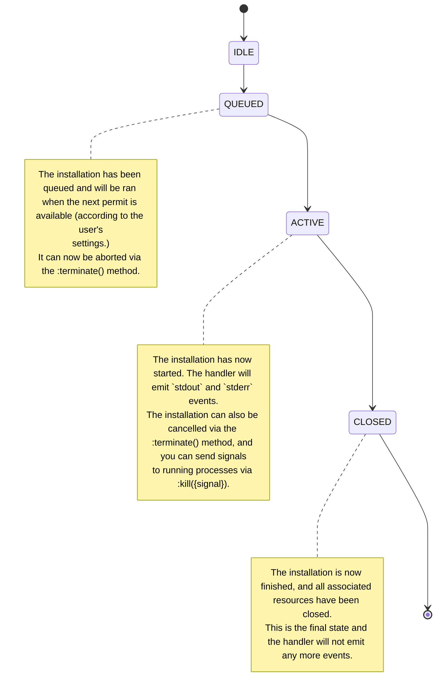

# Mason API reference

This document contains the API reference for `mason.nvim`'s' public APIs and is a more in-depth complementary to the
documentation available in `:h mason`.
The intended audience of this document are plugin developers and people who want to further customize their own Neovim
configuration.

_Note that APIs not listed in this document (or `:h mason`) are not considered public, and are subject to unannounced,
breaking, changes. Use at own risk._

Please [reach out](https://github.com/williamboman/mason.nvim/discussions/new?category=api-suggestions) if you think
something is missing or if something could be improved!

---

The key words "MUST", "MUST NOT", "REQUIRED", "SHALL", "SHALL NOT", "SHOULD", "SHOULD NOT", "RECOMMENDED", "NOT
RECOMMENDED", "MAY", and "OPTIONAL" in this document are to be interpreted as described in [BCP 14][bcp14],
[RFC2119][rfc2119], and [RFC8174][rfc8174] when, and only when, they appear in all capitals, as shown here.

---

[bcp14]: https://tools.ietf.org/html/bcp14
[rfc2119]: https://tools.ietf.org/html/rfc2119
[rfc8174]: https://tools.ietf.org/html/rfc8174

-   [Architecture diagram](#architecture-diagram)
-   [Registry events](#registry-events)
-   [`PackageSpec`](#packagespec)
-   [`RegistryPackageSpec`](#registrypackagespec)
-   [`Package`](#package)
    -   [`Package.Parse({package_identifier})`](#packageparsepackage_identifier)
    -   [`Package.Lang`](#packagelang)
    -   [`Package.Cat`](#packagecat)
    -   [`Package.new({spec})`](#packagenewspec)
    -   [`Package.spec`](#packagespec-1)
    -   [`Package:install({opts})`](#packageinstallopts)
    -   [`Package:uninstall()`](#packageuninstall)
    -   [`Package:is_installed()`](#packageis_installed)
    -   [`Package:get_install_path()`](#packageget_install_path)
    -   [`Package:get_installed_version({callback})`](#packageget_installed_versioncallback)
    -   [`Package:check_new_version({callback})`](#packagecheck_new_versioncallback)
-   [`NewPackageVersion`](#newpackageversion)
-   [`InstallContext`](#installcontext)
    -   [`InstallContext.package`](#installcontextpackage)
    -   [`InstallContext.handle`](#installcontexthandle)
    -   [`InstallContext.cwd`](#installcontextcwd)
    -   [`InstallContext.spawn`](#installcontextspawn)
    -   [`InstallContext.fs`](#installcontextfs)
    -   [`InstallContext.requested_version`](#installcontextrequested_version)
    -   [`InstallContext.stdio_sink`](#installcontextstdio_sink)
-   [`InstallHandleState`](#installhandlestate)
-   [`InstallHandle`](#installhandle)
    -   [`InstallHandle.package`](#installhandlepackage)
    -   [`InstallHandle.state`](#installhandlestate-1)
    -   [`InstallHandle.is_terminated`](#installhandleis_terminated)
    -   [`InstallHandle:is_idle()`](#installhandleis_idle)
    -   [`InstallHandle:is_queued()`](#installhandleis_queued)
    -   [`InstallHandle:is_active()`](#installhandleis_active)
    -   [`InstallHandle:is_closed()`](#installhandleis_closed)
    -   [`InstallHandle:kill({signal})`](#installhandlekillsignal)
    -   [`InstallHandle:terminate()`](#installhandleterminate)
-   [`EventEmitter`](#eventemitter)
    -   [`EventEmitter:on({event}, {handler})`](#eventemitteronevent-handler)
    -   [`EventEmitter:once({event, handler})`](#eventemitteronceevent-handler)
    -   [`EventEmitter:off({event}, {handler})`](#eventemitteroffevent-handler)

## Architecture diagram

<!-- https://excalidraw.com/#json=vbTmp7nM8H5odJDiaw7Ue,TghucvHHAw8bl7sgX1VuvA -->


## Registry events

The `mason-registry` Lua module extends the [EventEmitter](#eventemitter) interface and emits the following events:

| Event                       | Handler signature                          |
| --------------------------- | ------------------------------------------ |
| `package:handle`            | `fun(pkg: Package, handle: InstallHandle)` |
| `package:install:success`   | `fun(pkg: Package, handle: InstallHandle)` |
| `package:install:failed`    | `fun(pkg: Package, handle: InstallHandle)` |
| `package:uninstall:success` | `fun(pkg: Package)`                        |

The following is an example for how to register handlers for events:

```lua
local registry = require "mason-registry"

registry:on(
    "package:handle",
    vim.schedule_wrap(function(pkg, handle)
        print(string.format("Installing %s", pkg.name))
    end)
)

registry:on(
    "package:install:success",
    vim.schedule_wrap(function(pkg, handle)
        print(string.format("Successfully installed %s", pkg.name))
    end)
)
```

## `PackageSpec`

**Type:**

| Key        | Value                               |
| ---------- | ----------------------------------- |
| name       | `string`                            |
| desc       | `string`                            |
| homepage   | `string`                            |
| categories | [`PackageCategory[]`](#packagecat)  |
| languages  | [`PackageLanguage[]`](#packagelang) |
| install    | `async fun(ctx: InstallContext)`    |

## `RegistryPackageSpec`

| Key         | Value                               |
| ----------- | ----------------------------------- |
| schema      | `"registry+v1"`                     |
| name        | `string`                            |
| description | `string`                            |
| homepage    | `string`                            |
| licenses    | `string`                            |
| categories  | [`PackageCategory[]`](#packagecat)  |
| languages   | [`PackageLanguage[]`](#packagelang) |
| source      | `table`                             |
| bin         | `table<string, string>?`            |
| share       | `table<string, string>?`            |
| opt         | `table<string, string>?`            |

## `Package`

Module: [`"mason-core.package"`](../lua/mason-core/package/init.lua)

The `Package` class encapsulates the installation instructions and metadata about a Mason package.

**Events**

This class extends the [EventEmitter](#eventemitter) interface and emits the following events:

| Event               | Handler signature            |
| ------------------- | ---------------------------- |
| `install:success`   | `fun(handle: InstallHandle)` |
| `install:failed`    | `fun(handle: InstallHandle)` |
| `uninstall:success` | `fun()`                      |

### `Package.Parse({package_identifier})`

**Parameters:**

-   `package_identifier`: `string` For example, `"rust-analyzer@nightly"`

**Returns:** `(string, string|nil)` Tuple where the first value is the name and the second value is the specified
version (or `nil`).

### `Package.Lang`

**Type:** `table<string, string>`

Metatable used to declare language identifiers. Any key is valid and will be automatically indexed on first access, for
example:

```lua
print(vim.inspect(Package.Lang)) -- prints {}
local lang = Package.Lang.SomeMadeUpLanguage
print(lang) -- prints "SomeMadeUpLanguage"
print(vim.inspect(Package.Lang)) -- prints { SomeMadeUpLanguage = "SomeMadeUpLanguage" }
```

### `Package.Cat`

**Type:**

```lua
Package.Cat = {
    Compiler = "Compiler",
    Runtime = "Runtime",
    DAP = "DAP",
    LSP = "LSP",
    Linter = "Linter",
    Formatter = "Formatter",
}
```

All the available categories a package can be tagged with.

### `Package.new({spec})`

**Parameters:**

-   `spec`: [`PackageSpec`](#packagespec)

### `Package.spec`

**Type**: [`PackageSpec`](#packagespec) or [`RegistryPackageSpec`](#registrypackagespec)

### `Package:install({opts})`

**Parameters:**

-   `opts`: `{ version: string|nil } | nil` (optional)

**Returns:** [`InstallHandle`](#installhandle)

Installs the package instance this method is being called on. Accepts an
optional `{opts}` argument, which can be used to specify a desired version to
install.

The returned [`InstallHandle`](#installhandle) can be used to observe progress and control the installation process
(e.g., cancelling).

_Note that if the package already have an active handle registered, that handler is returned instead of a new one._

### `Package:uninstall()`

Uninstalls the package instance this method is being called on.

### `Package:is_installed()`

**Returns:** `boolean`

### `Package:get_install_path()`

**Returns:** `string` The full path where this package is installed. _Note that this will always return a string,
regardless of whether the package is actually installed or not._

### `Package:get_installed_version({callback})`

**Parameters:**

-   `callback`: `fun(success: boolean, version_or_err: string)`

This method will asynchronously get the currently installed version, and invoke the provided `{callback}` with the
results.

### `Package:check_new_version({callback})`

**Parameters:**

-   `callback`: `fun(success: boolean, result_or_err: NewPackageVersion | string)`

This method will asynchronously check whether there's a newer version of the package, and invoke the provided
`{callback}` with the results.

_Note that the `{callback}` will only be invoked with `success = true` when there is a new version available (i.e. a
version that is considered newer/greater than the one currently installed). When a new version can not be found, either
because the current version is the latest or due to other issues, `{callback}` will be invoked with `success = false`._

_Note that this method will result in network calls and will error when there is no internet connection. Also, one
should call this method with care as to not cause high network traffic as well as respecting user's online privacy._

## `NewPackageVersion`

**Type:**

| Key             | Value    |
| --------------- | -------- |
| name            | `string` |
| current_version | `string` |
| latest_version  | `string` |

## `InstallContext`

The `InstallContext` class will be instantiated by Mason every time a package installer is executed. The `install`
function of a package will receive an instance of `InstallContext` as its first argument.

As the name suggests, this class provides contextual information to be used when installing a package. This includes
which package is being installed, a `spawn` method that allow you to spawn processes that (i) use the correct working
directory of the installation, and (ii) automatically registers stdout and stderr with the `InstallHandle`.

### `InstallContext.package`

**Type:** [`Package`](#package)

### `InstallContext.handle`

**Type:** [`InstallHandle`](#installhandle)

### `InstallContext.cwd`

**Type:** [`CwdManager`](#cwdmanager)

### `InstallContext.spawn`

**Type:** [`ContextualSpawn`](#contextualspawn)

### `InstallContext.fs`

**Type:** [`ContextualFs`](#contextualfs)

### `InstallContext.requested_version`

**Type:** `Optional<string>`

### `InstallContext.stdio_sink`

**Type:** `{ stdout: fun(chunk: string), stderr: fun(chunk: string) }`

The `.stdio_sink` property can be used to send stdout or stderr output, to be presented to the user.

Example:

```lua
Pkg.new {
    --- ...
    ---@async
    ---@param ctx InstallContext
    install = function(ctx)
        ctx.stdio_sink.stdout "I am doing stuff\n"
        ctx.stdio_sink.stderr "Something went wrong!\n"
    end,
}
```

## `ContextualFs`

Provides wrapper functions around `mason-core.fs`. These wrapper functions all accept relative paths, which will be
expanded based on the associated `InstallContext`'s current working directory.

## `ContextualSpawn`

**Type:** `table<string, async fun(opts: SpawnOpts)>`

Provides an asynchronous interface to spawn processes (via libuv). Each spawned process will, by default, be spawned
with the current working directory of the `InstallContext` it belongs to. stdout & stderr will also automatically be
registered with the relevant `InstallHandle`.

Example usage:

```lua
Pkg.new {
    --- ...
    ---@async
    ---@param ctx InstallContext
    install = function(ctx)
        ctx.spawn.npm { "install", "some-package" }
        -- Calls to spawn will raise an error if it exits with a non-OK exit code or signal.
        pcall(function()
            ctx.spawn.commandoesntexist {}
        end)
    end,
}
```

## `CwdManager`

Manages the current working directory of an installation (through `InstallContext`).

### `CwdManager:set({cwd)})`

**Parameters:**

-   `cwd`: `string`

Changes the current working directory to `{cwd}`. `{cwd}` MUST be within the user's configured `install_root_dir`
setting.

### `CwdManager:get()`

**Returns:** `string`

## `InstallHandleState`

**Type:** `"IDLE" | "QUEUED" | "ACTIVE" | "CLOSED"`

## `InstallHandle`

An `InstallHandle` is a handle for observing and controlling the installation of a package.
Every package installed via Mason will be managed via a `InstallHandle` instance.

It has a finite set of states, with an initial (`IDLE`) and terminal (`CLOSED`) one. This state can be accessed via the
`InstallHandle.state` field, or through one of the `:is_idle()`, `:is_queued()`, `:is_active()`, `:is_closed()` methods.
In most cases a handler's state will transition like so:



**Events**

This class extends the [EventEmitter](#eventemitter) interface and emits the following events:

| Event          | Handler signature                                                   |
| -------------- | ------------------------------------------------------------------- |
| `stdout`       | `fun(chunk: string)`                                                |
| `stderr`       | `fun(chunk: string)`                                                |
| `state:change` | `fun(new_state: InstallHandleState, old_state: InstallHandleState)` |
| `kill`         | `fun(signal: integer)`                                              |
| `terminate`    | `fun()`                                                             |
| `closed`       | `fun()`                                                             |

### `InstallHandle.package`

**Type:** [`Package`](#package)

### `InstallHandle.state`

**Type:** [`InstallHandleState`](#installhandlestate)

### `InstallHandle.is_terminated`

**Type:** `boolean`

### `InstallHandle:is_idle()`

**Returns:** `boolean`

### `InstallHandle:is_queued()`

**Returns:** `boolean`

### `InstallHandle:is_active()`

**Returns:** `boolean`

### `InstallHandle:is_closed()`

**Returns:** `boolean`

### `InstallHandle:kill({signal})`

**Parameters:**

-   `signal`: `integer` The `signal(3)` to send.

### `InstallHandle:terminate()`

Instructs the handle to terminate itself. On Windows, this will issue a
`taskkill.exe` treekill on all attached libuv handles. On Unix, this will
issue a SIGTERM signal to all attached libuv handles.

## `EventEmitter`

The `EventEmitter` interface includes methods to subscribe (and unsubscribe)
to events on the associated object.

### `EventEmitter:on({event}, {handler})`

**Parameters:**

-   `event`: `string`
-   `handler`: `fun(...)`

Registers the provided `{handler}`, to be called every time the provided
`{event}` is dispatched.

_Note that the provided `{handler}` may be executed outside the main Neovim loop (`:h vim.in_fast_event()`), where most
of the Neovim API is disabled._

### `EventEmitter:once({event, handler})`

**Parameters:**

-   `event`: `string`
-   `handler`: `fun(...)`

Registers the provided `{handler}`, to be called only once - the next time the
provided `{event}` is dispatched.

_Note that the provided `{handler}` may be executed outside the main Neovim loop (`:h vim.in_fast_event()`), where most
of the Neovim API is disabled._

### `EventEmitter:off({event}, {handler})`

**Parameters:**

-   `event`: `string`
-   `handler`: `fun(...)`

Deregisters the provided `{handler}` for the provided `{event}`.
